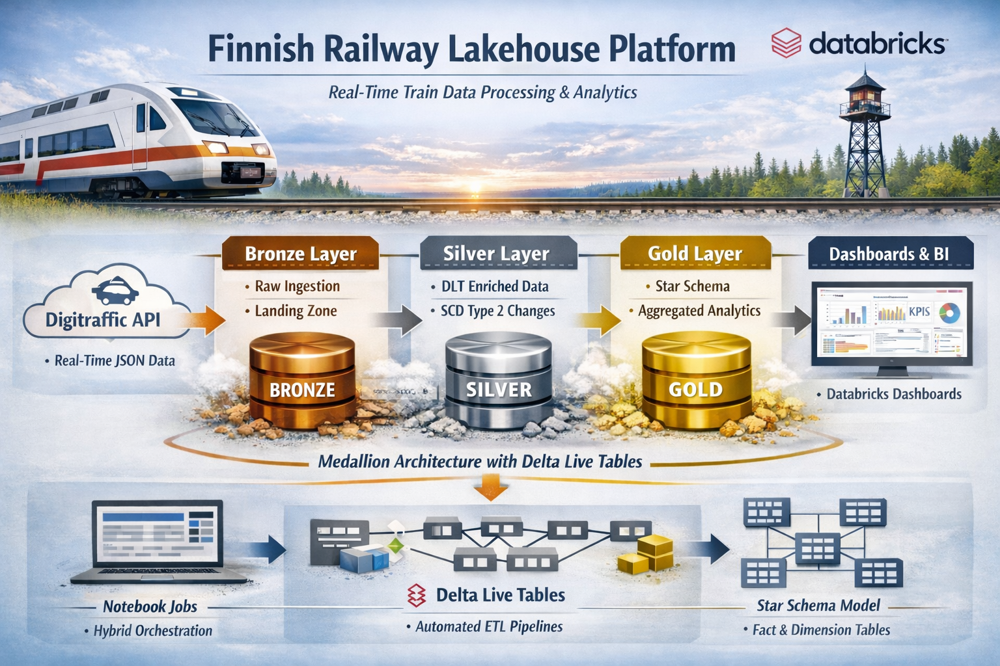

# 🚂 Finnish Railway Lakehouse Platform

A production-grade Data Lakehouse processing real-time train data from the Finnish Transport Agency ([Digitraffic API](https://www.digitraffic.fi/en/railway-traffic/)). Built on Databricks, implementing a Medallion Architecture with Delta Live Tables (DLT) for ETL and Star Schema analytics.

###📋 Project Overview

This project builds an end-to-end data platform to analyze train delays, cancellations, and schedule deviations in Finland. It handles real-time data streams and historical schedules to provide actionable insights.

#### Key Features
- Real-Time Ingestion: Fetches live train locations & metadata every 10 minutes.
- Medallion Architecture: Organized into Bronze (Raw), Silver (Clean/Enriched), and Gold (Aggregated) layers.
- Delta Live Tables (DLT): Managed ETL pipelines with quality expectations and lineage.
- Star Schema Gold Layer: Optimized dimension/fact tables for Power BI/Dashboarding.
- SCD Type 2: Tracks station metadata changes over time.
- Hybrid Orchestration: Combines Notebook-based ingestion with DLT via Databricks Workflows.

### 🏗️ Architecture


### 📂 Project Structure
```
finnish-railway-platform/
├── README.md                   # You are here
├── sql/                        # Setup scripts (Unity Catalog schemas)
└── src/
    ├── bronze/                 # Ingestion Layer
    │   ├── raw_ingestion/      # API Fetchers (Requests -> JSON)
    │   │   ├── ingestion_live_trains.ipynb
    │   │   ├── ingestion_schedules.ipynb
    │   │   └── ingestion_stations.ipynb
    │   └── delta_tables/       # Autoloader (JSON -> Delta Table)
    │       ├── bronze_live_trains.ipynb
    │       ├── bronze_schedules.ipynb
    │       └── bronze_stations.ipynb
    ├── silver/                 # DLT Processing Layer
    │   └── dlt_pipeline/       # Modular DLT Python Code
    │       ├── stations.py     # SCD2 Logic
    │       ├── train_stops.py  # Flattening & Cleaning
    │       ├── schedules.py    # Reference Data
    │       └── silver_pipeline.py # Entry Point
    └── gold/                   # Analytics Layer
        └── gold_analytics_dlt.ipynb # Star Schema Transformations
```
### 🚀 Production Deployment

#### Prerequisites
- Databricks Workspace.
- GitHub integration configured.

##### 1. Setup Environment
- Run in Databricks SQL Editor 
`sql/setup_unity_objects`

##### 2. Databricks Workflows (Production Jobs)

The platform uses two orchestrated jobs to handle different data frequencies:

**Job 1:** `Railway_Pipeline_Prod` **(Every 10 Minutes)**
```
| Task               | Type         | Notebook/Pipeline                                    | Purpose                                 |
| ------------------ | ------------ | ---------------------------------------------------- | --------------------------------------- |
| Ingest_Live_Trains | Notebook     | src/bronze/raw_ingestion/ingestion_live_trains.ipynb | Fetches latest JSON from API.           |
| Bronze_Live_Trains | Notebook     | src/bronze/delta_tables/bronze_live_trains.ipynb     | Streams JSON → Bronze Delta.            |
| Silver_Gold_DLT    | DLT Pipeline | src/silver/dlt_pipeline/ + src/gold/                 | Updates Silver tables & Gold analytics. |

```
**Schedule:** `*/10 * * * *`  **(Every 10 minutes).**

**Job 2:** `Railway_Daily_Reference_Data` **(Daily at 01:00 AM)**
```
| Task             | Type     | Notebook/Pipeline                                  | Purpose                           |
| ---------------- | -------- | -------------------------------------------------- | --------------------------------- |
| Ingest_Stations  | Notebook | src/bronze/raw_ingestion/ingestion_stations.ipynb  | Fetches station metadata.         |
| Bronze_Stations  | Notebook | src/bronze/delta_tables/bronze_stations.ipynb      | Writes to Bronze Stations Delta.  |
| Ingest_Schedules | Notebook | src/bronze/raw_ingestion/ingestion_schedules.ipynb | Fetches schedule data.            |
| Bronze_Schedules | Notebook | src/bronze/delta_tables/bronze_schedules.ipynb     | Writes to Bronze Schedules Delta. |

```
**Schedule:** `0 0 1 * * ?` **(Daily at 1:00 AM).**

### 📊 Analytics Goals & KPIs

- **Station Performance**: `AVG(delay_minutes) by station_name`
- **Service Reliability**: `Cancellation rates by train_type.`
- **Schedule Adherence**: `live_scheduled_time - original_planned_time.`
- **Passenger Impact**: `Filter commercial_stop = true.`

### 🛠️ Tech Stack

- **Compute:** Databricks (Spark 3.5+)

- **Orchestration:** Databricks Workflows + Delta Live Tables

- **Language:** Python (PySpark)

- **Format:** Delta Lake (Parquet)

- **Source:** [Digitraffic API](https://www.digitraffic.fi/en/railway-traffic/)


### 📜 License
MIT License. Data provided by [Digitraffic.fi](https://www.digitraffic.fi/en/railway-traffic/).


